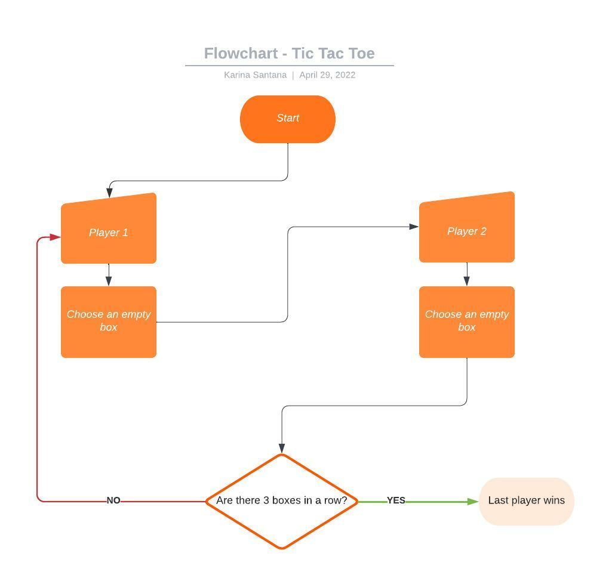

# Tic Tac Toe

## Sumary

This is a Tic Tac Toe game.

<a href="https://karina-santana.github.io/tic-tac-toe/">Click here to play the game</a>

How to play:

- First add the names of the two players, save and start playing.
- Go clicking on the boxes trying to form a combination of 3 boxes with your symbol.
- You can combine 3 boxes horizontally, vertically or both diagonally.
- The first player to get a combination of 3 boxes wins.
- To reset the game, press the 'Play Again' button.
- To reset the scores, press the 'Reset Scores' button.

## Plan

**Step1:**
Create all HTML elements:
Create the title's game (h1).
Create 2 sections for each player.
In each player's section create an input to store the player's name and a 'save' button.
Create 9 boxes (divs) with a class called game-section.
Create a 'play again' button.
Create a 'reset scores' button.

**Step2:**
Create a variable for the player turn which will receive a 'X' value.
Create a function and an EventListener with an if inside to make sure the game will always be alternating between 'X' and 'O'. 
The if condition is: when player turns is equal to 'X' the clicked box will have an 'X' inside, then the player turn will have a 'O' value. If player turn is equal to 'O' the clicked box will have an 'O' inside and then the player turn will have a 'X' value. 

**Step3:**
Create a checkWinner function with an if statement to check the winner. 
The if conditons were: if box1, box2 and box3 or box4, box5, box6 or box7 box8 box9 are equal to 'X' print that the player 1 won.
Make all possible conditions to win the game for both players.

Create a removeEventListener function with a for loop inside to remove the event listener when a player won.

Call the removeEventListener function inside of the checkWinner function.

**Step4**
Do not allow a player to click 2 consecutive times.
Create a for loop with an EventListener and an if statement with the condition that if the user clicks on a box that has an 'X' value or 'O' value, use the pointerEvents method to not assign any more value to the boxes.

**Step5**
Create a count variable with a value of 0 and add an else if statement in the if of step 3 (checkWinner function) saying that if the count variable is equal to 9 print that it is a draw.

**Step6**
Create 2 equal Events Listeners for when the user clicks on the input save buttons in each player sections. Then store the input value that the user typed in the player section title. Make the placeholder empty and then make it have a string 'Change your name here'.

**Step7**
Create an h3 element to say which player won the game or if it is a tie and then store the created element in the parent where I want to show.

**Step8**
Create an event listener for when the user clicks the 'Play Again' button, all the boxes become empty and white. Then make the boxes clickable again. The method pointerEvents can help with that. Then say that the playerTurn variable will receive the value of 'X', the counter variable will receive the value of 0 and the h3 element (telling which player won or if it was a tie) will receive an empty value. So everything can start all over again.

**Step9**
Create variables that grab the players scores and put them in the checkWinner function by assigning the value of itself + 1.
So each time the player wins, the score will increase + 1 point.

**Step 10**
Think about how to reduce and clean up the code a bit. Try storing if statements conditions in variables with arrays to see if it works.

**Step 11**
Make the website responsive for mobile.
